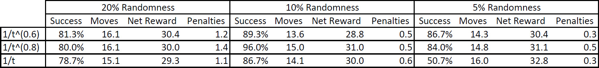

# Basic Driving Agent
When actions are chosen purely by random and the agent is given unlimited time to reach the destination, it does eventually reach it. However, this is purely a matter of chance.

# Indentifying and Updating State
**Relevant state variables:**
* Direction of next waypoint: `[None, 'forward', 'left', 'right']`
* Light status: `['red', 'green']`
* Oncoming traffic: `[None, 'forward', 'left', 'right']`
* Traffic to the left: `[None, 'forward', 'left', 'right']`

**Valid actions:** `[None, 'forward', 'left', 'right']`

In this simplistic model, the smartcab cares about two things: first, the location of the next waypoint; and second, its ability (right of way) to execute its valid actions.

Of the provided inputs, I've decided to ignore two:
* Deadline: Having the cab's behavior depend on the remaining time seems to me to be undesirable. Also, since there are so many possible values, including this variable would make the state space enormous.
* Traffic to the right: This has no affect on the cab's ability to execute its chosen action:
    - If traffic to the right is empty, there is obviously no impact.
    - If traffic to the right is proceeding straight or turning left, its light must be green and therefore the light for the cab must be red. That means the cab can only turn right, which traffic on the right can not impair.
    - If traffic to the right is turning right, the cab has the right of way to proceed straight. It clearly does not affect the cab's ability to turn left or right.

# Implementing Q-Learning
My Q-learning model is initialized uniformly with a value of 1 for all state/action pairs. The learning rate is `1/t` and the discount factor is 0.5. It has a 10% chance to return a random action other than the one with the highest Q-value.

The agent now consistently learns to reach the destination in time. For the first several trials it often fails to do so, but by trial 50 this trend has shifted. By trial 100 it almost always reaches the destination in time and rarely receives any penalties.

The agent was previously choosing random actions at each step. It is now using the reward received after taking an action to update the Q-value of that state/action pair. After enough trials, the Q-values should converge to reveal a reasonable policy. This is consistent with the behavior observed above.

# Optimizing the Agent
I identified the following parameters of the agent for tuning:
* The chance of randomly taking an action other than the one with the best Q-value.
* The power of the learning rate (1/t^(power))

The performance of each parameter combination was measured in the last 25 trials of three sets of 100 trials each. The following metrics were gathered:
* Percentage of trials in which the cab reached the destination in time
* Average time to reach destination (of successful trials)
* Average net reward (of successful trials)
* Average penalties received (of successful trials)

The results are shown below:


Based on these result, I believe a randomness of 10% and learning rate of 1/t^0.8 to be the best choice. The cab reaches the destination 96% of the time. It takes slightly longer, on average, than the other learning rates at 10% randomness, but I think consistent on-time delivery is more important. In addition, the cab receives less than one penalty per trip on average, many of which are probably due to the cab taking its random action.

Q-values produced after 100 trials using these parameter values are listed below. The states are listed as tuples of waypoint, light status, oncoming traffic status, left traffic status.

```python
{
    ('forward', 'green', None, None): {'forward': 5.435114865285471, 'left': 2.4032638308606082, 'right': 1.916037234329821, None: 2.857916898117176},
    ('forward', 'green', None, 'forward'): {'forward': 2.321740711327675, 'left': 1, 'right': 1, None: 1},
    ('forward', 'green', None, 'right'): {'forward': 5.130630722022692, 'left': 1, 'right': 1, None: 1},
    ('forward', 'green', None, 'left'): {'forward': 1.2495132711148689, 'left': 1, 'right': 1, None: 1},
    ('forward', 'green', 'forward', None): {'forward': 2.9999999999999987, 'left': 1, 'right': 1, None: 1},
    ('forward', 'green', 'right', None): {'forward': 1, 'left': 1, 'right': 1.6352760038775067, None: 1},
    ('forward', 'green', 'left', None): {'forward': 2.0788442078521787, 'left': 1, 'right': 1.0573543475987444, None: 1},
    ('forward', 'red', None, None): {'forward': 0.05705630836340217, 'left': 0.01619020129152201, 'right': 1.955125077056673, None: 2.0},
    ('forward', 'red', None, 'forward'): {'forward': 0.009657456886476262, 'left': 1, 'right': 1, None: 1.1649384888466119},
    ('forward', 'red', None, 'right'): {'forward': 0.8444993810736191, 'left': 1, 'right': 1, None: 1},
    ('forward', 'red', None, 'left'): {'forward': 0.6837628939440246, 'left': 0.8444993810736191, 'right': 1, None: 1},
    ('forward', 'red', 'forward', None): {'forward': 0.6837628939440246, 'left': 0.7158031437793004, 'right': 1, None: 1},
    ('forward', 'red', 'right', None): {'forward': 0.5860811015616356, 'left': 0.6422577297236862, 'right': 1, None: 1},
    ('forward', 'red', 'left', None): {'forward': 0.3771345301922415, 'left': 0.13847623375222368, 'right': 1.9438624257270534, None: 1},

    ('right', 'green', None, None): {'forward': 2.5851705943470042, 'left': 1.9599149692249167, 'right': 3.4737030904287414, None: 2.68972695645543},
    ('right', 'green', None, 'right'): {'forward': 1.1137814807435202, 'left': 1, 'right': 1, None: 1},
    ('right', 'green', None, 'left'): {'forward': 1.1428728400803796, 'left': 1, 'right': 1, None: 1},
    ('right', 'green', 'left', None): {'forward': 1, 'left': 1.2210792065333615, 'right': 1, None: 1}
    ('right', 'green', 'left', 'forward'): {'forward': 1.1610184557611893, 'left': 1, 'right': 1, None: 1},
    ('right', 'red', None, None): {'forward': 0.6837628939440246, 'left': 0.8824027848175164, 'right': 3.3140576275627476, None: 2.9698874597915155},
    ('right', 'red', None, 'right'): {'forward': 1, 'left': 1, 'right': 1, None: 1},
    ('right', 'red', None, 'left'): {'forward': 1, 'left': 1, 'right': 1, None: 1},
    ('right', 'red', 'forward', None): {'forward': -0.5, 'left': -0.12664696577922102, 'right': 2.972461229158127, None: 1},
    ('right', 'red', 'right', None): {'forward': 0.6837628939440246, 'left': 0.5051845334601647, 'right': 1, None: 1},
    ('right', 'red', 'left', None): {'forward': 0.3771345301922415, 'left': 0.24381606637080264, 'right': 2.380090808472715, None: 1},
    ('right', 'red', 'left', 'forward'): {'forward': 0.5860811015616356, 'left': 1, 'right': 1, None: 1},

    ('left', 'green', None, None): {'forward': 1.1421506396866425, 'left': 5.625387851718434, 'right': 1.5205576975343003, None: 1},
    ('left', 'green', 'left', None): {'forward': 1.2008952021774568, 'left': 1, 'right': 1, None: 1},
    ('left', 'red', None, None): {'forward': -0.42991731184970444, 'left': 0.22511475002484338, 'right': 1.8331033925667108, None: 1.3261446506504435},
    ('left', 'red', 'forward', None): {'forward': 1, 'left': 1, 'right': 1.1489971881394845, None: 1},
    ('left', 'red', 'left', None): {'forward': -0.5, 'left': 0.13847623375222368, 'right': 1.9462251074334946, None: 1},
}
```

Looking at the above Q-values, two things stand out to me:
* We are still very far from visiting all state/action pairs, so these Q-values should not be considered to have converged.
* Though the Q-values seem reasonable in many cases, I see several states where the action with the highest Q-value doesn't agree with common sense. For example `('right', 'green', None, 'right')` and `('right', 'green', None, 'left')` both show `forward` as the best action even though the waypoint is to the right and the way is clear to turn right.

In other words, the policy given by these Q-values is far from optimal. However, at 96% on-time delivery, it seems reasonably feasible.